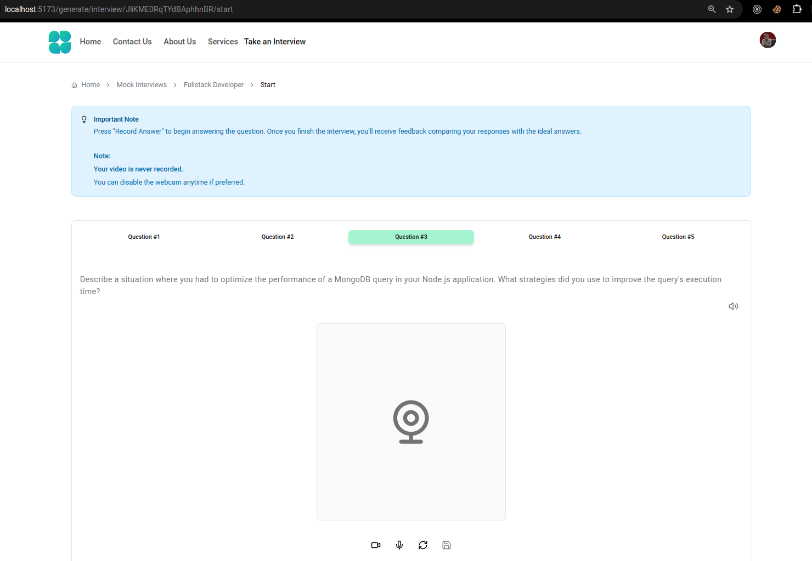
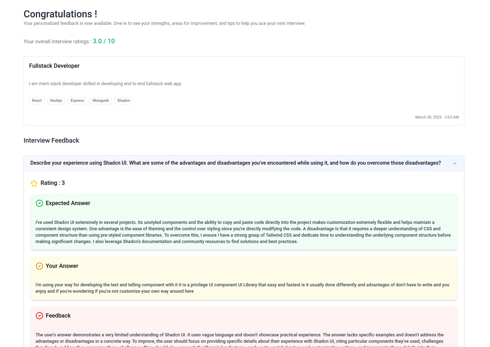
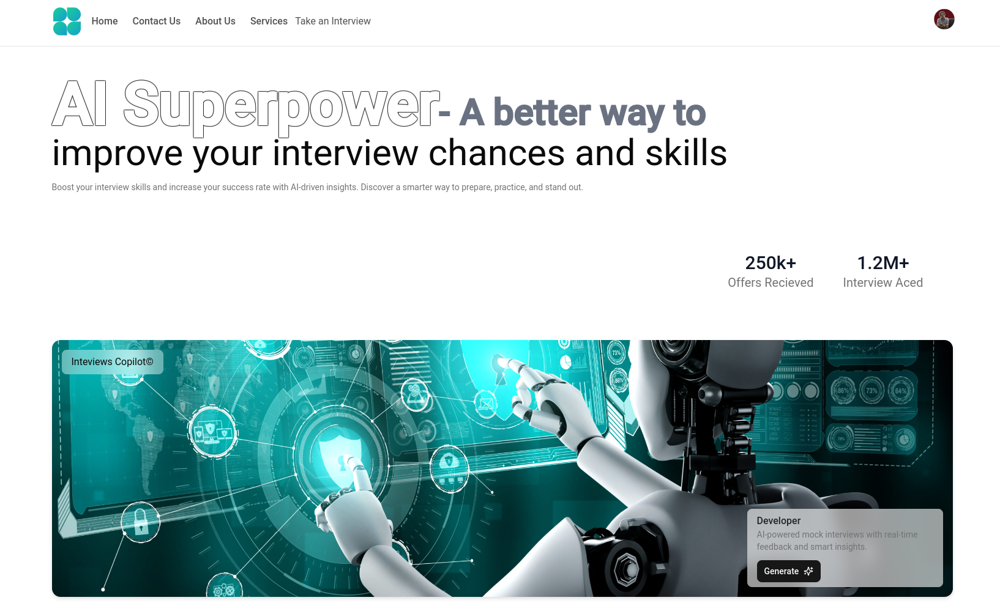
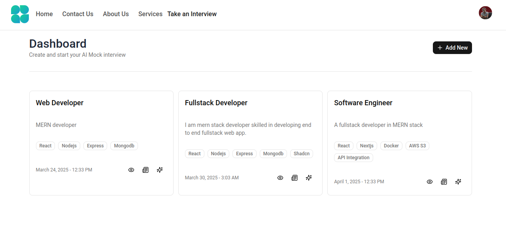
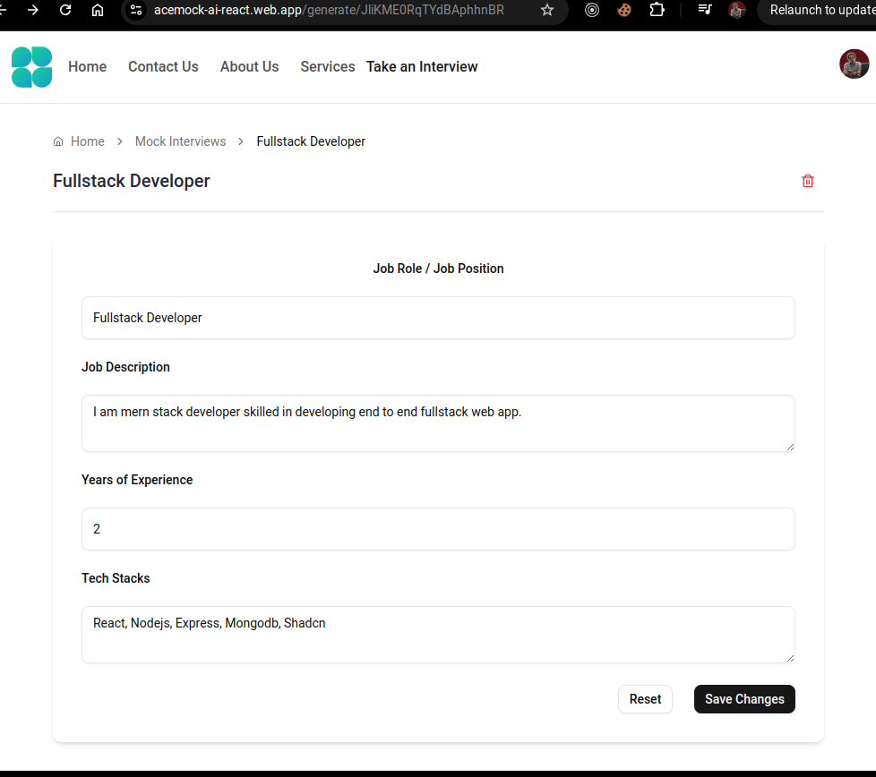
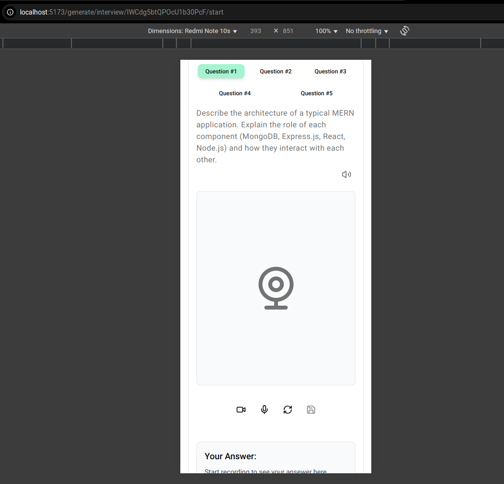
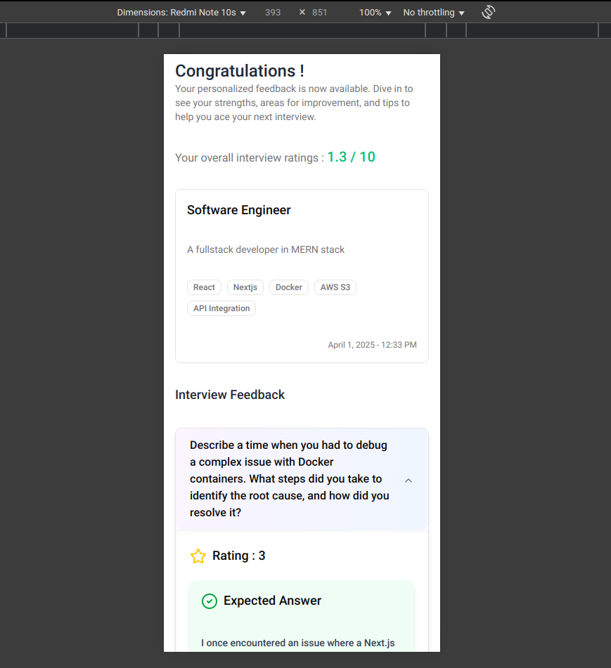

# AceMock_AI - AI-driven interview questions using Gemini AI

A repository for AceMock_AI app using Gemini AI to generate intelligent interview questions, analyze user responses, and provide real-time feedback, helping users improve their interview skills effectively.
 
- <a target="_blank" href="https://acemock-ai-react.web.app">App Link 🔗</a>

# Interview Questions Page
- Google Gemini AI for realistic AI-driven interview questions 
- Text-to-Speech Analysis for feedback on user responses
</img>

# Feedback of your interview
- AI-generated analysis your interview performance
- Rating overall performace
- Expected an ideal answer might includes, helping you understand the key points to cover in similar future questions.
- A record of original response
- Feedback on your responses, offering constructive criticism and tips for enhancement.
</img>

# Home Page
- A well-designed homepage.
</img>

# Dashboard
- All your AI Mock interview questions are displayed.
</img>

# Edit or Delete
- User can edit or delete the interview according to your preferences.
</img>

# Phone View
- Compatible with all types of devices, the platform is fully responsive and optimized for mobile, tablet etc...
</img>
</img>

# Contact
For questions or feedback, feel free to reach out:
- Email : aazimsadan99@gmail.com
- Linkedin : https://www.linkedin.com/in/aazim-sadan

